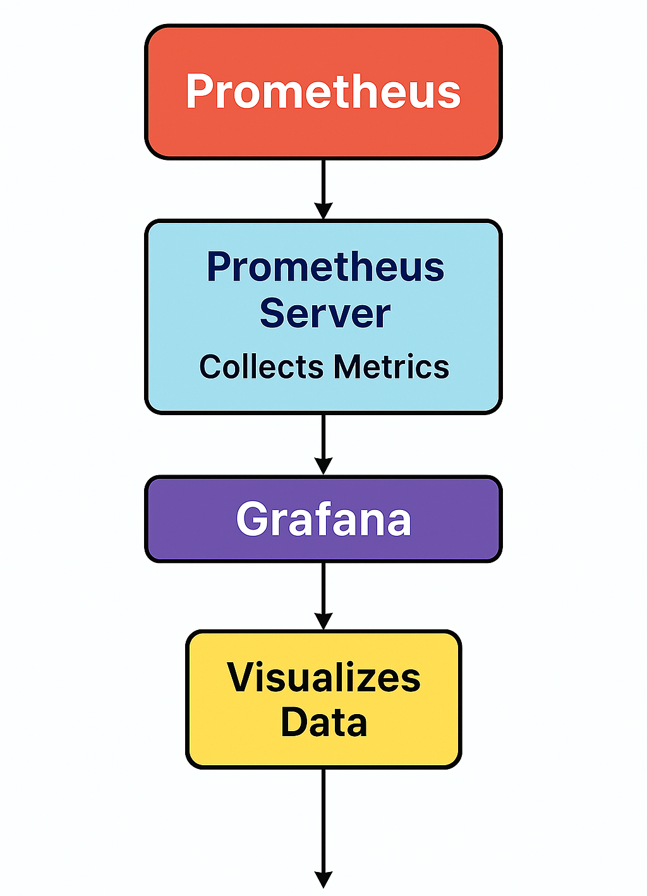

# 🔗 Standalone Monitoring Stack with Prometheus + Grafana

This project involved setting up a **monitoring-only stack** using **Prometheus** and **Grafana** on a local Kubernetes cluster (Minikube). No application deployment was necessary; the process served to understand how observability functions—from metric scraping to dashboard visualization.

---

## 🔗 Key Objectives Achieved

* Deployed Prometheus using Helm
* Deployed Grafana using Helm
* Observed how Prometheus scrapes metrics from services
* Connected Grafana to Prometheus to visualize dashboards

---

## 🔗 Project Directory Structure

```
devops_project_04_monitoring/
├── prometheus-grafana/
│   ├── prometheus-values.yaml
│   ├── grafana-values.yaml
├── README.md
```

---

## 🔗 Prerequisites

* Minikube installed
* Docker installed
* Helm & kubectl installed

### 🔗 Tool Verification Commands

```bash
which minikube
which kubectl
which helm
```

---

## 🔗 Step 1: Start the Minikube Cluster

```bash
minikube start --driver=docker
```

---

## 🔗 Step 2: Add Helm Repositories

```bash
helm repo add prometheus-community https://prometheus-community.github.io/helm-charts
helm repo add grafana https://grafana.github.io/helm-charts
helm repo update
```

---

## 🔗 Step 3: Deploy Prometheus

A custom values file `prometheus-values.yaml` was created:

```yaml
alertmanager:
  enabled: false

pushgateway:
  enabled: false

server:
  service:
    type: NodePort
    nodePort: 30090
```

Prometheus was then installed using the following command:

```bash
helm install prometheus prometheus-community/prometheus -f prometheus-grafana/prometheus-values.yaml
```

---

## 🔗 Step 4: Deploy Grafana

A custom `grafana-values.yaml` was created:

```yaml
adminPassword: admin
service:
  type: NodePort
  nodePort: 30030
```

Grafana was then installed using:

```bash
helm install grafana grafana/grafana -f prometheus-grafana/grafana-values.yaml
```

---

## 🔗 Step 5: Access Dashboards

Services were exposed using:

```bash
minikube service prometheus
minikube service grafana
```

Grafana login credentials used:

* **Username:** admin
* **Password:** admin

### 🔗 Configure Prometheus as a Data Source in Grafana

1. Navigated to Grafana UI > Settings > Data Sources
2. Selected Prometheus
3. Set the URL to: `http://prometheus-server`
4. Clicked Save & Test

---

## 🔗 Visual Diagram (Prometheus + Grafana)



---

## 🔗 Visual Representation of the Monitoring Stack

The diagram below provides a high-level overview of how Prometheus and Grafana interact within the monitoring stack. Prometheus collects and scrapes metrics from Kubernetes services, while Grafana connects to Prometheus to visualize these metrics through customizable dashboards.

<p align="center">
  
</p>

This visualization helped reinforce the architectural understanding and the communication flow between the components in the stack.

---

## 🔗 Clean Up Procedure

```bash
helm uninstall prometheus
helm uninstall grafana
minikube stop
```

---

🔗 Setup Complete!

Results achieved:

* Prometheus is actively scraping metrics from Kubernetes targets
* Grafana dashboards have been successfully powered by Prometheus
